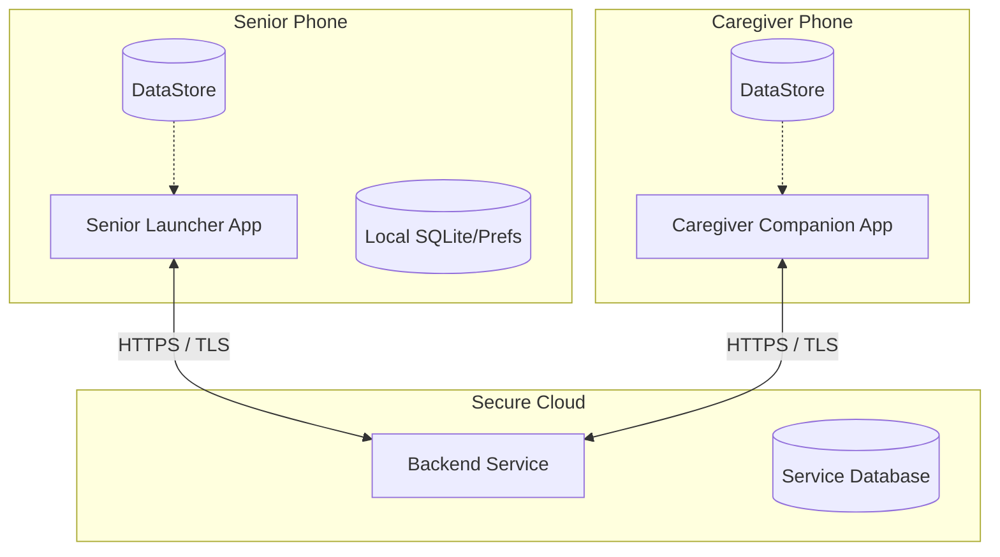

# Senior Launcher & Caregiver Ecosystem Architecture

This document describes the design and interactions between the three modules of the system: the Senior Launcher, Caregiver Companion, and Backend service.

## Core Component Diagram

## Security & Data Isolation Boundaries

* **Offline-first Launcher**: The Senior Launcher stores all layout, local contacts, and local reminders in `DataStore` and local repositories. It executes normally without internet access.
* **Consent-first Caregiver Pairing**: Caregivers pair via short-lived QR codes or tokens. The pairing must be explicitly approved by the senior user.
* **Granular Caregiver Permissions**: The pairing defines the exact permission scope (e.g. view battery, update layout). The Senior Launcher enforces these permissions locally when applying suggestions.
* **Data Minimization**: The Backend stores only metadata necessary for pairing, battery alerts, voluntary check-ins, and config staging. No PII like message contents or call history is transmitted.
